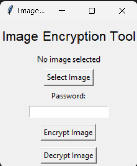
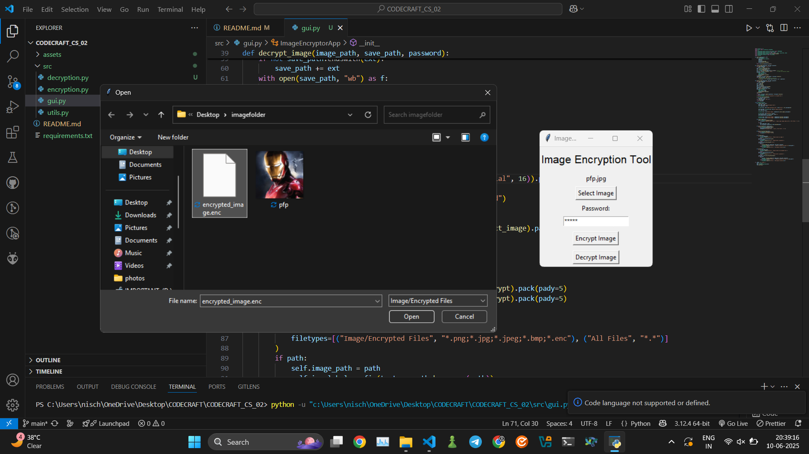

# Image Encryption Tool

A simple yet powerful tool for encrypting and decrypting images using AES encryption, with a user-friendly graphical interface built in Tkinter.


*Example: Main GUI window*

## Features

- **AES Encryption:** Securely encrypts images using AES (Advanced Encryption Standard).
- **Password Protection:** Only users with the correct password can decrypt images.
- **Extension Preservation:** Automatically restores the original image format after decryption.
- **Custom Save Location:** Choose where to save encrypted and decrypted files.
- **Intuitive GUI:** Easy-to-use interface for all users.

## Project Structure

```
CODECRAFT_CS_02
├── src
│   ├── gui.py          # Main GUI application
│   ├── encryption.py   # Encryption logic
│   ├── decryption.py   # Decryption logic
│   └── utils.py        # Utility functions
├── assets
│   └── screenshot.png  # Example screenshot(s)
├── requirements.txt    # Python dependencies
└── README.md           # Project documentation
```

## Installation

1. **Clone the repository:**
   ```
   git clone https://github.com/Nischayabeniwal/CODECRAFT_CS_02
   cd CODECRAFT_CS_02
   ```

2. **Install dependencies:**
   ```
   pip install -r requirements.txt
   ```

## Usage

1. **Run the application:**
   ```
   python src/gui.py
   ```

2. **Encrypt an image:**
   - Click "Select Image" and choose your image file.
   - Enter a password.
   - Click "Encrypt Image" and choose where to save the encrypted file.

3. **Decrypt an image:**
   - Click "Select Image" and choose your `.enc` file.
   - Enter the password used for encryption.
   - Click "Decrypt Image" and choose where to save the decrypted image.

## Example

### Encrypting an Image


### Decrypting an Image



## Dependencies

- **Pillow:** Image processing.
- **Tkinter:** Graphical user interface.
- **cryptography:** AES encryption and decryption.

Install all dependencies with:
```
pip install -r requirements.txt
```

## License

This project is licensed under the Apache License 2.0 . See the [LICENSE](LICENSE) file for more details.